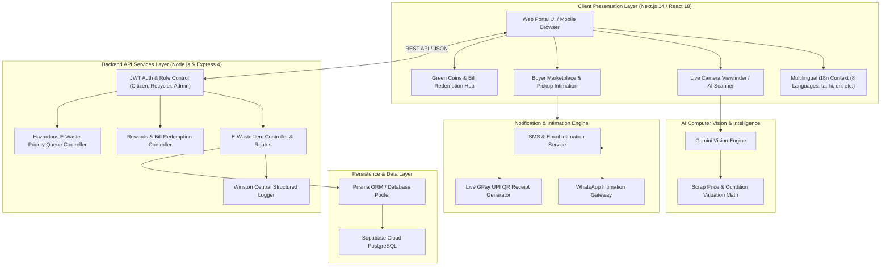

# 🏛️ EcoRoute — Full Enterprise System Architecture Specification

Official Architecture & Technology Stack Specification for **EcoRoute** — Government of India (CPCB & MoEFCC) Standard AI-Powered E-Waste Management & Recycling Marketplace Platform.

---

## 1. High-Level System Architecture



---

## 2. Monorepo Repository Structure

```text
EcoRoute/
├── app/                        # Next.js 14 App Router (Frontend Application)
│   ├── (auth)/                 # Authentication Pages (/login, /register)
│   │   ├── login/page.tsx      # Full-width Split Layout Login
│   │   └── register/page.tsx   # Full-width Split Layout Register
│   ├── api/                    # Next.js Serverless API Endpoints
│   │   ├── ai/scan-image/      # AI Image Vision Processing API
│   │   ├── auth/               # Auth APIs (login, register)
│   │   └── ewaste/             # E-Waste CRUD & Marketplace APIs
│   ├── buyer/                  # Buyer Portal (Scrap Marketplace & Pickup Intimation)
│   ├── dashboard/              # Citizen Dashboard (/upload, /rewards, /pickups)
│   └── layout.tsx              # Root Layout with LanguageProvider & Header/Footer
├── backend/                    # Node.js & Express REST API Subsystem
│   ├── src/
│   │   ├── config/             # database.js, auth.js, logger.js (Winston)
│   │   ├── controllers/        # userController, itemController, rewardController
│   │   ├── routes/             # userRoutes, itemRoutes, rewardRoutes, priorityRoutes
│   │   ├── models/             # userModel, itemModel, rewardModel, priorityModel
│   │   ├── middlewares/        # authMiddleware, errorMiddleware, validationMiddleware
│   │   ├── services/           # userService, itemService, rewardService, priorityService
│   │   └── tests/              # Jest Unit & Integration Test Suites
│   ├── Dockerfile
│   └── package.json
├── components/                 # Shared UI & Form Components
│   ├── citizen/                # Citizen Dashboard components & Video Wrapper
│   ├── forms/                  # FormInput, PasswordInput, FormSelect, GovAlertBox
│   └── layout/                 # Header (i18n Language Dropdown), Navbar, Footer
├── docs/                       # Project Specifications & Documentation
│   ├── api.md                  # Complete REST API reference
│   ├── database.md             # PostgreSQL schema & entity relationships
│   ├── architecture.md         # Full System Architecture (This file)
│   ├── user-guide.md           # End-user manual
│   └── ci/ci-pipeline.yml      # GitHub Actions CI workflow
├── lib/                        # Shared Utilities & Libraries
│   ├── i18n.tsx                # Multilingual translation engine (8 Indian Languages)
│   └── ewaste-store.ts         # Scrap Marketplace state store & initial listings
├── supabase/                   # Database Schemas & Migrations
│   └── schema.sql              # Supabase PostgreSQL DDL, Triggers & RLS Policies
├── docker-compose.yml          # Multi-container Orchestration (Backend:5000, Frontend:3000)
└── README.md                   # Project Documentation & Getting Started Guide
```

---

## 3. Component Deep Dive

### 3.1 Presentation & UI Layer (Frontend)
- **Framework**: Next.js 14 (App Router) + React 18 + TypeScript.
- **Styling**: Tailwind CSS + Vanilla CSS Tokens + Glassmorphism (`backdrop-blur-md`, `rgba(255,255,255,0.85)`).
- **Animations**: Framer Motion for smooth page transitions and floating card effects.
- **Multilingual i18n (`lib/i18n.tsx`)**:
  - React Context (`LanguageProvider` & `useTranslation`).
  - Supports **8 Indian Languages**: English (`en`), Hindi (`hi`), Tamil (`ta`), Telugu (`te`), Marathi (`mr`), Bengali (`bn`), Kannada (`kn`), Gujarati (`gu`).
  - Auto-persists selection in `localStorage` and sets `<html lang="code">`.

### 3.2 AI Computer Vision Engine (`/api/ai/scan-image`)
- **Technology**: Gemini Vision Model / Advanced Computer Vision.
- **Functionality**:
  1. Accepts base64 JPEG image payload captured via live camera stream or upload.
  2. Verifies whether the image is genuine e-waste/scrap (Authenticity Score 0-100%).
  3. Identifies device name, brand, category, physical condition, estimated weight (kg), and age.
  4. Applies **Automated Valuation Formula**:
     $$\text{Final Price} = \text{Base Category Price} \times \text{Condition Multiplier}$$

### 3.3 Buyer Marketplace & Pickup Intimation Subsystem (`/buyer`)
- **Real-Time Scrap Marketplace**: Allows verified recyclers to filter scrap by category, city, and device type.
- **Checkout & Payment**:
  - **Cash on Pickup**: Intimates seller of collection date and time slot.
  - **UPI / GPay**: Displays cropped GPay QR Code (`M ANGU`, `batmanangu@okhdfcbank`) for direct scanning.
  - **Card / NetBanking**: Form with 256-bit SSL PCI-DSS simulated encryption.
- **Pickup Intimation**: Generates CPCB Purchase Token and pushes live notifications to seller dashboard with WhatsApp / Phone / Maps navigation links.

### 3.4 Green Coins & Bill Redemption Subsystem (`/dashboard/rewards`)
- **Green Coin Accrual**: Earned based on recycled scrap item weight and category.
- **Redemption Options**:
  - **Direct Cash (UPI / GPay)**: Transferred directly to user's bank.
  - **Electricity (EB) Bill Rebates**: Direct deduction on state power utility bills.
  - **Water Bill Waivers**: Municipal water bill credit.
  - **Gift Cards**: E-commerce eco vouchers.

### 3.5 Microservices Backend & Persistence
- **Backend Server**: Node.js + Express 4 running on Port 5000.
- **Authentication**: JWT token authorization (`Authorization: Bearer <token>`) + `bcryptjs` password hashing.
- **Logging**: **Winston** structured logger (`logger.js`) capturing HTTP requests and system errors.
- **Database**: **Supabase Cloud PostgreSQL** managed via Prisma ORM with RLS policies.

---

## 4. Database Schema Overview

```sql
-- Core Users Table
CREATE TABLE users (
  id UUID PRIMARY KEY DEFAULT gen_random_uuid(),
  name VARCHAR(255) NOT NULL,
  email VARCHAR(255) UNIQUE NOT NULL,
  mobile VARCHAR(15),
  password_hash TEXT NOT NULL,
  role VARCHAR(50) DEFAULT 'CITIZEN', -- CITIZEN, RECYCLER, OFFICER, ADMIN
  created_at TIMESTAMP WITH TIME ZONE DEFAULT CURRENT_TIMESTAMP
);

-- E-Waste Scrap Listings Table
CREATE TABLE ewaste_listings (
  id UUID PRIMARY KEY DEFAULT gen_random_uuid(),
  device_name VARCHAR(255) NOT NULL,
  brand VARCHAR(100),
  category VARCHAR(100) NOT NULL,
  condition VARCHAR(100) NOT NULL,
  price VARCHAR(50) NOT NULL,
  seller_name VARCHAR(255) NOT NULL,
  seller_city VARCHAR(100) NOT NULL,
  status VARCHAR(50) DEFAULT 'AVAILABLE', -- AVAILABLE, SOLD, GOV_RESERVED
  created_at TIMESTAMP WITH TIME ZONE DEFAULT CURRENT_TIMESTAMP
);

-- Reward Points & Redemptions Table
CREATE TABLE rewards (
  id UUID PRIMARY KEY DEFAULT gen_random_uuid(),
  user_id UUID REFERENCES users(id),
  points INT NOT NULL,
  type VARCHAR(50) NOT NULL, -- EARNED, REDEEMED_CASH, REDEEMED_EB_BILL, REDEEMED_WATER_BILL
  description TEXT,
  created_at TIMESTAMP WITH TIME ZONE DEFAULT CURRENT_TIMESTAMP
);
```

---

## 5. Security & Compliance Standards

1. **CPCB & MoEFCC E-Waste Rules 2022**: Adheres to Government of India Central Pollution Control Board guidelines.
2. **ISO 27001 Security**: 256-bit SSL encrypted communication across all REST endpoints.
3. **Digital Personal Data Protection Act 2023**: Encrypted storage of citizen PII data.
4. **CI/CD Pipeline**: GitHub Actions automated testing workflow (`docs/ci/ci-pipeline.yml`).
